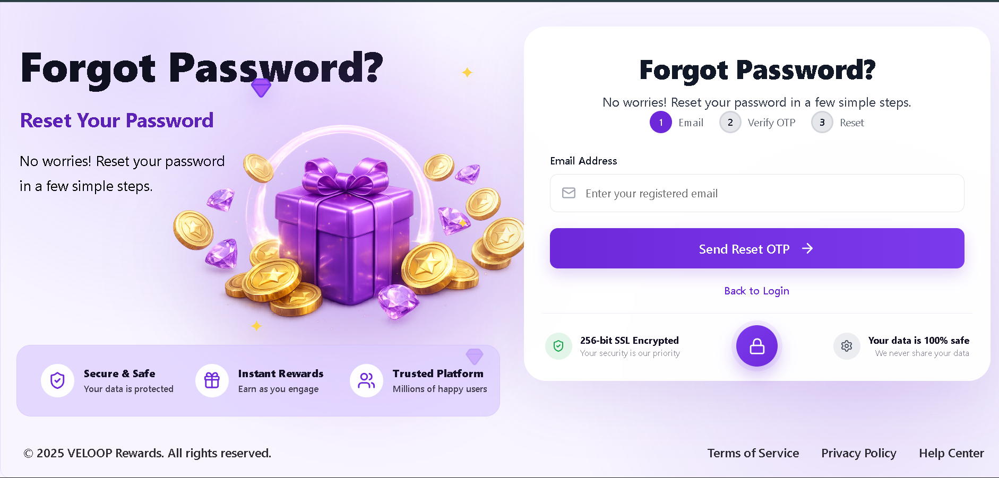

# 🔐 Veloop Authentication UI

A modern, responsive authentication interface built with **React.js**.

Veloop Authentication UI provides a complete authentication experience including **Login, Registration, Forgot Password, and OTP Verification** flows. The project focuses on clean UI design, reusable components, responsive layouts, form validation, and a smooth user experience across desktop, tablet, and mobile devices.

---

## 📌 Project Overview

Veloop Authentication UI is a frontend authentication system designed to provide users with a simple, modern, and secure authentication experience.

The project includes:

* 🔐 Login authentication flow
* 👤 User registration
* 🔢 OTP verification
* 🔑 Forgot password flow
* 🔒 Password validation
* 📊 Password strength requirements
* 📱 Responsive authentication layouts
* 🧩 Reusable UI components
* ⏳ Loading and toast states
* 🛡️ Security and trust indicators
* 📲 Mobile-optimized layouts

The application follows a **component-based React architecture**, making authentication components reusable, scalable, and easier to maintain.

---

# 🖥️ Component Preview

## 🔐 Login

<p align="center">
  
</p>

The login page provides:

* Email input
* Password input
* Password visibility toggle
* Remember me option
* Forgot password navigation
* OTP login option
* Registration navigation
* Form validation
* Loading states
* Toast notifications

---

## 👤 Register

<p align="center">
  
</p>

The registration flow includes:

* User information fields
* Password requirements
* Password confirmation
* OTP verification
* Step-based registration experience
* Form validation
* Password strength feedback

---

## 🔑 Forgot Password

<p align="center">
  
</p>

The forgot password flow allows users to:

1. Enter their email
2. Receive an OTP
3. Verify the OTP
4. Create a new password
5. Reset their password

---

# 📱 Mobile Preview

<p align="center">
  
</p>

The authentication interface is optimized for smaller screens while maintaining usability, accessibility, and visual consistency.

---

# 🎨 Design Highlights

## ✨ Modern Authentication UI

The interface uses a clean card-based design with:

* Modern typography
* Consistent spacing
* Rounded components
* Subtle shadows
* Clear visual hierarchy
* Responsive layouts

## 🧩 Reusable Components

Authentication elements are separated into reusable components such as:

* `AuthHeader`
* `AuthHero`
* `AuthCard`
* `AuthTabs`
* `PasswordInput`
* `PasswordChecklist`
* `OTPInput`
* `OTPTimer`

## 👁️ Visual Feedback

The UI provides feedback for:

* Invalid fields
* Password requirements
* Successful actions
* Loading states
* OTP verification
* Form errors
* Toast notifications

## 🖱️ Interactive Elements

The interface includes:

* Password visibility controls
* OTP inputs
* Authentication tabs
* Animated UI elements
* Hover states
* Focus states
* Responsive interactions

---

# 📱 Responsive Behavior

The application is designed to work across different screen sizes.

### 🖥️ Desktop

The authentication layout uses a two-column structure:

```text
┌──────────────────────────────┬───────────────────────┐
│                              │                       │
│       Authentication         │      Login/Register   │
│          Hero                │          Card         │
│                              │                       │
└──────────────────────────────┴───────────────────────┘
```

### 📱 Tablet

The layout adjusts:

* Spacing
* Column proportions
* Card dimensions
* Typography
* Hero content

to provide a comfortable experience on medium-sized screens.

### 📲 Mobile

On mobile devices:

* The layout changes to a single-column structure
* Hero content becomes compact
* Decorative elements are reduced
* Authentication cards use the available screen width
* Form controls become touch-friendly
* Content spacing is optimized
* Typography scales according to screen size

Dedicated responsive breakpoints are included for different mobile widths:

430px
414px
390px
375px
360px
320px
```

---

# ✨ Features

* 🔐 Login authentication UI
* 👤 User registration
* 🔑 Forgot password flow
* 🔢 OTP verification
* ⏱️ OTP countdown timer
* 👁️ Password visibility toggle
* ✅ Password requirement checklist
* ⚠️ Form validation
* 🔔 Toast notifications
* ⏳ Loading spinner
* 📱 Fully responsive design
* 🎨 Modern authentication interface
* 🧩 Reusable React components
* 🎞️ UI animations
* 🛡️ Security indicators
* ♻️ Component-based architecture

---

# 🛠️ Technology Stack

## Frontend

* React.js
* JavaScript
* JSX
* CSS3
* CSS Modules

## Development Tools

* Vite
* npm
* VS Code
* Git
* GitHub

## UI / Styling

* Responsive CSS
* CSS Variables
* CSS Animations
* Flexbox
* CSS Grid

---

# 📂 Project Structure

src/
│
├── assets/
│   ├── images/
│   │   ├── rewards/
│   │   ├── backgrounds/
│   │   └── logo/
│   │
│   └── icons/
│
├── components/
│   ├── auth/
│   │   ├── AuthLayout.jsx
│   │   ├── AuthLayout.module.css
│   │   ├── AuthHeader.jsx
│   │   ├── AuthHeader.module.css
│   │   ├── AuthHero.jsx
│   │   ├── AuthHero.module.css
│   │   ├── AuthCard.jsx
│   │   ├── AuthCard.module.css
│   │   ├── AuthTabs.jsx
│   │   ├── PasswordInput.jsx
│   │   ├── PasswordChecklist.jsx
│   │   ├── OTPInput.jsx
│   │   ├── OTPInput.module.css
│   │   └── OTPTimer.jsx
│   │
│   └── common/
│       ├── Button.jsx
│       ├── Input.jsx
│       ├── Toast.jsx
│       └── LoadingSpinner.jsx
│
├── hooks/
│   └── useOTP.js
│
├── pages/
│   ├── Login.jsx
│   ├── Register.jsx
│   └── ForgotPassword.jsx
│
├── utils/
│   └── validators.js
│
├── styles/
│   ├── globals.css
│   ├── variables.css
│   └── animations.css
│
├── App.jsx
└── main.jsx

---

# 🚀 Installation & Setup

## 1. Clone the Repository

```bash
git clone https://github.com/your-username/veloop-authentication-ui.git
```

## 2. Navigate to the Project

```bash
cd veloop-authentication-ui
```

## 3. Install Dependencies

```bash
npm install
```

## 4. Start the Development Server

```bash
npm run dev
```

The application will then be available at the local development URL provided by Vite.

---

# 💻 Development Commands

| Command           | Description                  |
| ----------------- | ---------------------------- |
| `npm install`     | Install project dependencies |
| `npm run dev`     | Start the development server |
| `npm run build`   | Create a production build    |
| `npm run preview` | Preview the production build |
| `npm run lint`    | Run ESLint                   |

---

# 🔄 User Journey

The authentication experience follows several user journeys.

## 🔐 Login Journey

User
  ↓
Login Page
  ↓
Enter Email & Password
  ↓
Validate Credentials
  ↓
Successful Login
```

## 🔢 OTP Login Journey

User
  ↓
Login
  ↓
Choose OTP Login
  ↓
Enter Email
  ↓
Receive OTP
  ↓
Enter OTP
  ↓
Verify OTP
  ↓
Authenticated
```

## 👤 Registration Journey

```text
User
  ↓
Register
  ↓
Enter Account Information
  ↓
Validate Password
  ↓
OTP Verification
  ↓
Account Created
```

## 🔑 Forgot Password Journey

```text
User
  ↓
Forgot Password
  ↓
Enter Email
  ↓
Receive OTP
  ↓
Verify OTP
  ↓
Create New Password
  ↓
Password Reset
```

---

# 🧩 Component Architecture

The project follows a reusable **component-based architecture**.

## Authentication Components

| Component           | Purpose                                |
| ------------------- | -------------------------------------- |
| `AuthLayout`        | Main authentication page layout        |
| `AuthHeader`        | Authentication header                  |
| `AuthHero`          | Hero section and illustration          |
| `AuthCard`          | Authentication form container          |
| `AuthTabs`          | Login / registration navigation        |
| `PasswordInput`     | Password input with visibility control |
| `PasswordChecklist` | Password requirement validation        |
| `OTPInput`          | OTP code input                         |
| `OTPTimer`          | OTP countdown and resend functionality |

## Common Components

| Component        | Purpose            |
| ---------------- | ------------------ |
| `Button`         | Reusable button    |
| `Input`          | Reusable input     |
| `Toast`          | User notifications |
| `LoadingSpinner` | Loading feedback   |

---

# 🎯 Project Goals

The main goals of this project are:

* Create a modern authentication experience
* Build reusable React components
* Practice responsive frontend development
* Implement OTP-based authentication flows
* Create a maintainable CSS architecture
* Provide a consistent experience across devices
* Improve component reusability and maintainability

---

# 📊 Project Status

**Status: 🟢 Completed / Frontend Ready**

### Current Implementation

* ✅ Login UI
* ✅ Registration UI
* ✅ Forgot password UI
* ✅ OTP interface
* ✅ OTP timer
* ✅ Password validation
* ✅ Responsive design
* ✅ Reusable components
* ✅ Form validation
* ✅ Loading states
* ✅ Toast notifications
* ✅ Mobile optimization

---

# 🔮 Future Improvements

The following features can be added when connecting the frontend to a production backend:

* 🔌 Connect authentication APIs
* 🖥️ Add backend authentication
* 🔑 Implement JWT/session management
* 📧 Connect real email/SMS OTP services
* 🛡️ Add protected routes
* 🧪 Add automated tests
* 🔐 Implement production-level security controls

---

# 👩‍💻 Author

## Sana Parveen

**Frontend / Full Stack Developer**

Built with ❤️ using **React.js**.
